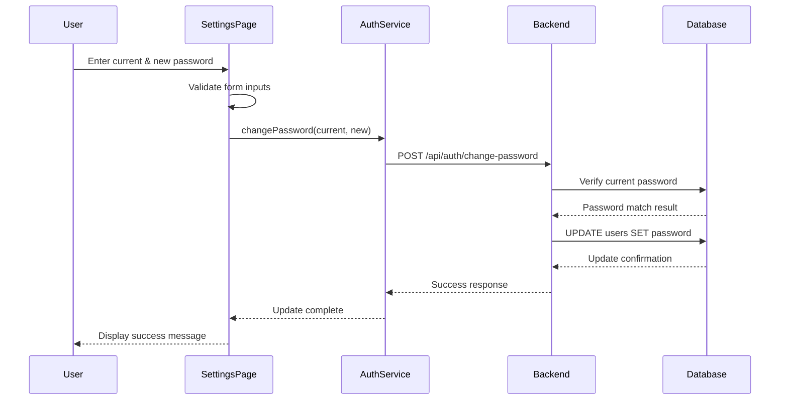
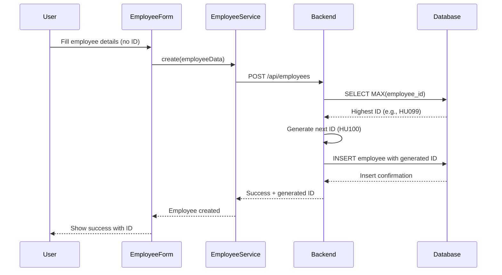

# Design Document: User Management Enhancements

## Overview

This design document outlines the implementation of two key enhancements to the HU Employee Management System:

1. **Admin Password Change**: Enables administrators to securely update their passwords through a dedicated interface
2. **Automatic Employee ID Generation**: Eliminates manual employee ID entry by automatically generating sequential IDs in the format HU001, HU002, etc.

These enhancements improve system security and streamline the employee registration workflow. The implementation follows the existing architecture pattern with React frontend components, Express.js backend API endpoints, and MySQL database storage.

## Architecture

### System Components

The implementation follows the existing three-tier architecture:

1. **Presentation Layer (React)**
   - New Settings page component for password management
   - Modified EmployeeForm component with hidden employee ID field
   - Form validation and user feedback

2. **Application Layer (Express.js)**
   - Enhanced `/api/auth/change-password` endpoint
   - Modified `/api/employees` POST endpoint with auto-ID generation
   - Password validation and ID generation logic

3. **Data Layer (MySQL)**
   - Existing `users` table for password storage
   - Existing `employees` table for employee records
   - Transaction support for ID generation

### Component Interaction Flow





## Components and Interfaces

### Frontend Components

#### 1. Settings Page Component

**Location**: `src/pages/settings/Settings.jsx`

**Purpose**: Provides a user interface for administrators to change their password

**State Management**:
```javascript
{
  currentPassword: string,
  newPassword: string,
  confirmPassword: string,
  loading: boolean,
  error: string | null,
  success: boolean
}
```

**Key Methods**:
- `handleSubmit()`: Validates form and calls authService.changePassword()
- `validateForm()`: Ensures passwords meet requirements and match
- `handleChange()`: Updates form state on input changes

**Validation Rules**:
- Current password: required, non-empty
- New password: required, minimum 8 characters
- Confirm password: must match new password
- New password must differ from current password

#### 2. Modified EmployeeForm Component

**Location**: `src/pages/employees/EmployeeForm.jsx`

**Changes**:
- Remove `employee_id` from formData initial state
- Remove employee ID input field from JSX
- Update success message to display generated employee ID
- Handle API response containing generated ID

**Updated State**:
```javascript
{
  // employee_id removed from here
  first_name: string,
  last_name: string,
  gender: string,
  // ... other fields remain unchanged
}
```

### Backend API Endpoints

#### 1. Change Password Endpoint

**Endpoint**: `POST /api/auth/change-password`

**Request Body**:
```javascript
{
  currentPassword: string,
  newPassword: string
}
```

**Response**:
```javascript
// Success
{
  success: true,
  message: "Password changed successfully"
}

// Error - Invalid current password
{
  success: false,
  message: "Current password is incorrect"
}

// Error - Validation failed
{
  success: false,
  message: "New password must be at least 8 characters"
}
```

**Implementation Logic**:
1. Extract userId from JWT token in request headers
2. Query database for user's current password
3. Compare provided currentPassword with stored password
4. Validate newPassword length (minimum 8 characters)
5. Update password in database if validation passes
6. Return success or error response

#### 2. Modified Employee Creation Endpoint

**Endpoint**: `POST /api/employees`

**Request Body** (employee_id now optional):
```javascript
{
  // employee_id removed - will be auto-generated
  first_name: string,
  last_name: string,
  gender: string,
  date_of_birth: string,
  phone: string,
  email: string,
  position: string,
  department_id: number,
  employment_type: string,
  hire_date: string,
  salary: number
}
```

**Response**:
```javascript
// Success
{
  success: true,
  message: "Employee created",
  data: {
    id: number,
    employee_id: string  // Generated ID like "HU001"
  }
}

// Error
{
  success: false,
  message: string
}
```

**Implementation Logic**:
1. Query database: `SELECT employee_id FROM employees ORDER BY employee_id DESC LIMIT 1`
2. Extract numeric portion from highest employee_id (e.g., "HU099" → 99)
3. Increment by 1 (99 → 100)
4. Format as "HU" + zero-padded 3-digit number (100 → "HU100")
5. Handle edge case: if no employees exist, start with "HU001"
6. Insert employee record with generated employee_id
7. Return success response with generated ID

### Service Layer

#### AuthService Enhancement

**Location**: `src/services/authService.js`

**Existing Method** (already implemented):
```javascript
changePassword: async (currentPassword, newPassword) => {
  const response = await api.post('/api/auth/change-password', {
    currentPassword,
    newPassword
  });
  return response.data;
}
```

This method already exists in the codebase and will be used by the new Settings component.

#### EmployeeService Modification

**Location**: `src/services/employeeService.js`

**Modified Method**:
```javascript
create: async (employeeData) => {
  // Remove employee_id from employeeData if present
  const { employee_id, ...dataWithoutId } = employeeData;
  
  const response = await fetch('http://localhost:5000/api/employees', {
    method: 'POST',
    headers: {
      'Content-Type': 'application/json'
    },
    body: JSON.stringify(dataWithoutId)
  });
  return response.json();
}
```

## Data Models

### Users Table (Existing)

```sql
CREATE TABLE users (
  id INT PRIMARY KEY AUTO_INCREMENT,
  employee_id INT NOT NULL UNIQUE,
  email VARCHAR(100) UNIQUE NOT NULL,
  password VARCHAR(255) NOT NULL,  -- Updated by password change
  role ENUM('admin','hr_officer','department_head','finance_officer','employee'),
  status ENUM('active','inactive') DEFAULT 'active',
  last_login TIMESTAMP NULL,
  created_at TIMESTAMP DEFAULT CURRENT_TIMESTAMP,
  FOREIGN KEY (employee_id) REFERENCES employees(id)
)
```

**Password Change Impact**: Only the `password` field is modified

### Employees Table (Existing)

```sql
CREATE TABLE employees (
  id INT PRIMARY KEY AUTO_INCREMENT,
  employee_id VARCHAR(20) UNIQUE NOT NULL,  -- Auto-generated
  first_name VARCHAR(50) NOT NULL,
  last_name VARCHAR(50) NOT NULL,
  gender ENUM('male','female') NOT NULL,
  date_of_birth DATE NOT NULL,
  phone VARCHAR(20) NOT NULL,
  email VARCHAR(100) UNIQUE NOT NULL,
  position VARCHAR(100) NOT NULL,
  department_id INT,
  employment_type ENUM('academic','admin','support') NOT NULL,
  hire_date DATE NOT NULL,
  salary DECIMAL(12,2) NOT NULL,
  status ENUM('active','inactive') DEFAULT 'active',
  created_at TIMESTAMP DEFAULT CURRENT_TIMESTAMP,
  FOREIGN KEY (department_id) REFERENCES departments(id)
)
```

**Auto-Generation Impact**: The `employee_id` field is now populated automatically by the backend

### Employee ID Format Specification

**Format**: `HU` + zero-padded 3-digit sequential number

**Examples**:
- First employee: `HU001`
- Tenth employee: `HU010`
- Hundredth employee: `HU100`
- Thousandth employee: `HU1000` (expands beyond 3 digits)

**Generation Algorithm**:
```javascript
function generateEmployeeId(lastEmployeeId) {
  if (!lastEmployeeId) {
    return 'HU001';
  }
  
  // Extract numeric part (e.g., "HU099" -> "099")
  const numericPart = lastEmployeeId.replace('HU', '');
  const nextNumber = parseInt(numericPart, 10) + 1;
  
  // Pad with zeros to minimum 3 digits
  const paddedNumber = String(nextNumber).padStart(3, '0');
  
  return `HU${paddedNumber}`;
}
```


## Correctness Properties

A property is a characteristic or behavior that should hold true across all valid executions of a system—essentially, a formal statement about what the system should do. Properties serve as the bridge between human-readable specifications and machine-verifiable correctness guarantees.

### Password Change Properties

**Property 1: Current password validation requirement**
*For any* password change request, the system should require and validate the current password before allowing the change.
**Validates: Requirements 1.2, 3.2**

**Property 2: Successful password update**
*For any* password change request where the current password is correct and the new password is valid, the password in the database should be updated to the new value.
**Validates: Requirements 1.4**

**Property 3: Success feedback**
*For any* successful password change, the system should display a success confirmation message to the user.
**Validates: Requirements 1.5**

**Property 4: Password length validation**
*For any* new password with length less than 8 characters, the system should reject the change and display a validation error.
**Validates: Requirements 1.6**

**Property 5: Session persistence**
*For any* successful password change, the user's authentication session should remain active without requiring re-login.
**Validates: Requirements 1.7**

**Property 6: Password mismatch validation**
*For any* password change form submission where the new password and confirm password fields do not match, the system should display a validation error.
**Validates: Requirements 4.3**

**Property 7: Validation error messaging**
*For any* form validation failure, the system should display a clear error message indicating what needs to be corrected.
**Validates: Requirements 4.7**

### Employee ID Generation Properties

**Property 8: Automatic ID generation**
*For any* employee creation request, the system should automatically generate a unique employee ID without requiring manual input.
**Validates: Requirements 2.2, 3.5**

**Property 9: ID format compliance**
*For any* generated employee ID, it should match the format "HU" followed by a zero-padded number with minimum 3 digits (e.g., HU001, HU010, HU100).
**Validates: Requirements 2.3**

**Property 10: Sequential ID increment**
*For any* two consecutive employee creation requests, the second generated employee ID should have a numeric value exactly 1 greater than the first.
**Validates: Requirements 2.5**

**Property 11: ID uniqueness**
*For any* set of generated employee IDs in the database, all IDs should be unique with no duplicates.
**Validates: Requirements 2.8**

**Property 12: Generated ID in response**
*For any* successful employee creation, the API response should contain the generated employee ID.
**Validates: Requirements 2.7**

**Property 13: Generated ID in UI feedback**
*For any* successful employee creation, the user interface should display the generated employee ID in the success message or confirmation.
**Validates: Requirements 4.5**

## Error Handling

### Password Change Error Scenarios

1. **Invalid Current Password**
   - **Trigger**: User provides incorrect current password
   - **Response**: Return 401 status with message "Current password is incorrect"
   - **UI Behavior**: Display error message, keep form populated, focus on current password field

2. **Password Too Short**
   - **Trigger**: New password length < 8 characters
   - **Response**: Return 400 status with message "New password must be at least 8 characters"
   - **UI Behavior**: Display validation error below new password field

3. **Password Mismatch**
   - **Trigger**: New password and confirm password don't match
   - **Response**: Client-side validation prevents submission
   - **UI Behavior**: Display error "Passwords do not match" below confirm password field

4. **Database Error**
   - **Trigger**: Database connection failure or query error during password update
   - **Response**: Return 500 status with message "Failed to update password. Please try again."
   - **UI Behavior**: Display generic error message, log detailed error for debugging

5. **Unauthorized Access**
   - **Trigger**: User not authenticated or token expired
   - **Response**: Return 401 status with message "Authentication required"
   - **UI Behavior**: Redirect to login page

### Employee ID Generation Error Scenarios

1. **Database Query Failure**
   - **Trigger**: Error querying for highest employee ID
   - **Response**: Return 500 status with message "Failed to generate employee ID"
   - **UI Behavior**: Display error message, allow user to retry

2. **Duplicate ID Detected**
   - **Trigger**: Generated ID already exists (race condition)
   - **Response**: Retry with next sequential number (up to 3 attempts)
   - **Fallback**: If retries exhausted, return 500 status with message "Failed to generate unique employee ID"
   - **UI Behavior**: Display error message, suggest contacting administrator

3. **Employee Creation Failure**
   - **Trigger**: Database error during employee insertion
   - **Response**: Return 500 status with message "Failed to create employee"
   - **UI Behavior**: Display error message with details, preserve form data for retry

4. **Validation Errors**
   - **Trigger**: Required fields missing or invalid data types
   - **Response**: Return 400 status with specific validation errors
   - **UI Behavior**: Display field-specific error messages

## Testing Strategy

### Dual Testing Approach

This feature will be tested using both unit tests and property-based tests to ensure comprehensive coverage:

- **Unit Tests**: Verify specific examples, edge cases, and error conditions
- **Property-Based Tests**: Verify universal properties across all inputs

Both testing approaches are complementary and necessary for comprehensive coverage. Unit tests catch concrete bugs in specific scenarios, while property-based tests verify general correctness across a wide range of inputs.

### Property-Based Testing Configuration

We will use **fast-check** (for JavaScript/TypeScript) as our property-based testing library. Each property test will:

- Run a minimum of 100 iterations to ensure thorough input coverage
- Be tagged with a comment referencing the design document property
- Tag format: `// Feature: user-management-enhancements, Property {number}: {property_text}`

### Test Coverage

#### Password Change Tests

**Unit Tests**:
- Test successful password change with valid inputs
- Test rejection of incorrect current password (edge case)
- Test rejection of password < 8 characters
- Test rejection of mismatched passwords
- Test session persistence after password change
- Test error handling for database failures
- Test UI rendering of password change form
- Test password field masking (type="password")

**Property-Based Tests**:
- Property 1: Current password validation requirement
- Property 2: Successful password update
- Property 3: Success feedback
- Property 4: Password length validation
- Property 5: Session persistence
- Property 6: Password mismatch validation
- Property 7: Validation error messaging

#### Employee ID Generation Tests

**Unit Tests**:
- Test first employee ID is "HU001" (edge case)
- Test ID generation with existing employees
- Test ID format for various numbers (HU001, HU010, HU100, HU1000)
- Test duplicate ID retry mechanism (edge case)
- Test error handling for database failures (edge case)
- Test UI rendering without employee ID field
- Test success message displays generated ID

**Property-Based Tests**:
- Property 8: Automatic ID generation
- Property 9: ID format compliance
- Property 10: Sequential ID increment
- Property 11: ID uniqueness
- Property 12: Generated ID in response
- Property 13: Generated ID in UI feedback

### Testing Tools

- **Frontend Testing**: Jest + React Testing Library
- **Backend Testing**: Jest + Supertest (for API testing)
- **Property-Based Testing**: fast-check
- **Database Testing**: In-memory SQLite or test MySQL database

### Test Data Generation

For property-based tests, we will generate:

**Password Test Data**:
- Random strings of varying lengths (0-50 characters)
- Strings with special characters, numbers, letters
- Valid and invalid password combinations

**Employee Data**:
- Random employee records with all required fields
- Various employee ID sequences
- Edge cases: empty database, single employee, many employees

### Continuous Integration

All tests (unit and property-based) will run on every commit and pull request to ensure:
- No regressions in existing functionality
- New features meet correctness properties
- Code quality standards are maintained
